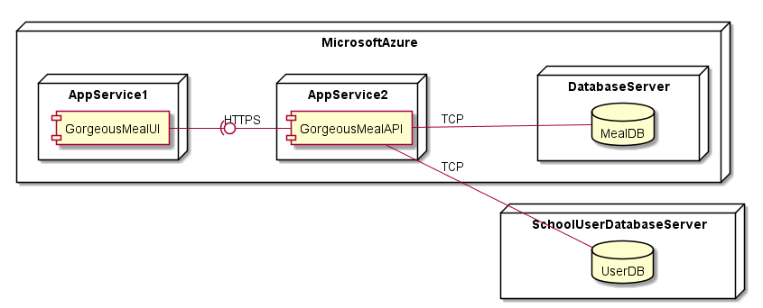
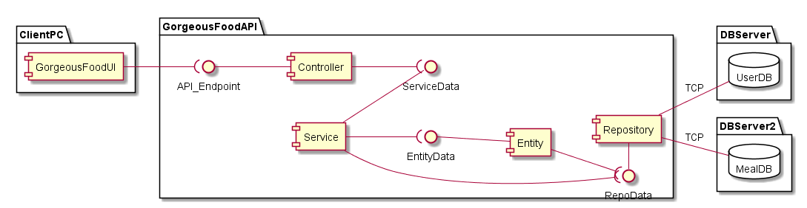

# Gorgeous Food App ADD Iteration 1#

In this iteration, the objective is to create a structure for the system considering that it is a Greenfield type of system.
Although the inputs have different priorities, in this iteration, all inputs are considered in order to produce an overall system structure.
A reference architecture is chosen as well as a deployment pattern.

## System Deployment View

---

## Logical View of Server Components

## Kanban Board
Task | Not Addressed | Partially addressed | Addressed
--- | --- | --- | ---
Structure the system | | X
QA-4 | | X | 
CT-1 | | X | 
CT-6 | | X |
AC-1 | | | X
AC-2 | | | X
AC-3 | | | X

---
