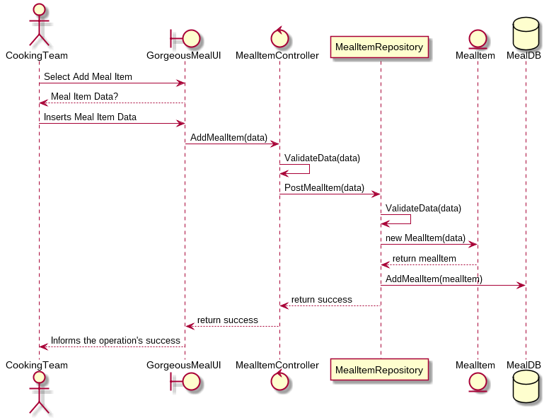

# Gorgeous Food App ADD Iteration 3#
The objective of this iteration is to address the quality atribute QA-4 and refine the architecture for the UC-1, UC-2, UC-3 implementation.

## Sequence Diagrams

## Kanban Board
Task | Not Addressed | Partially addressed | Addressed
--- | --- | --- | ---
UC-1 | | | X
UC-2 | | | X
UC-3 | | | X

---
