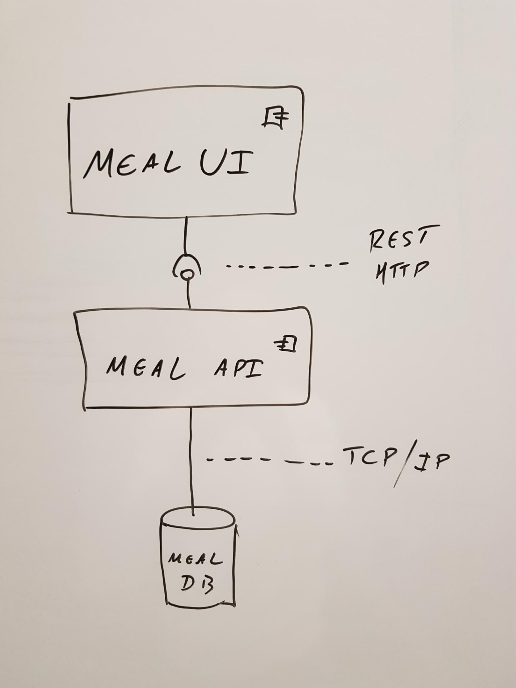
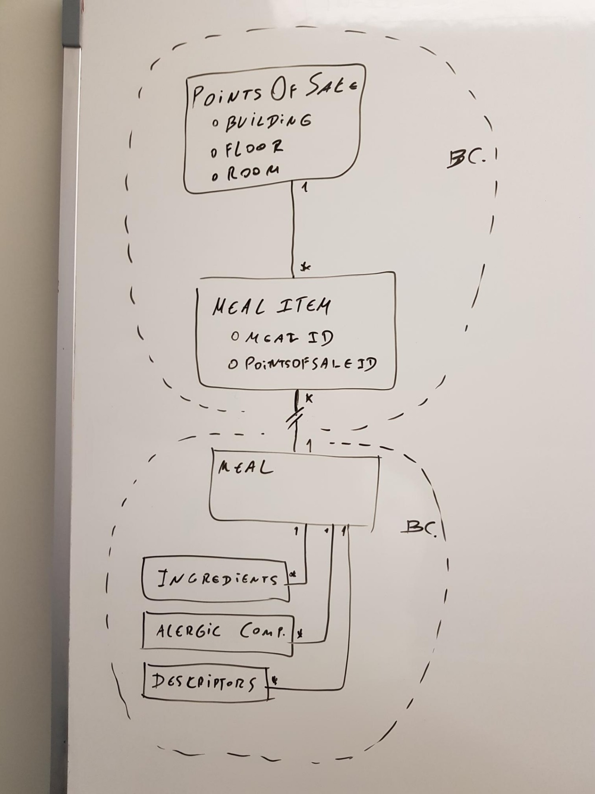
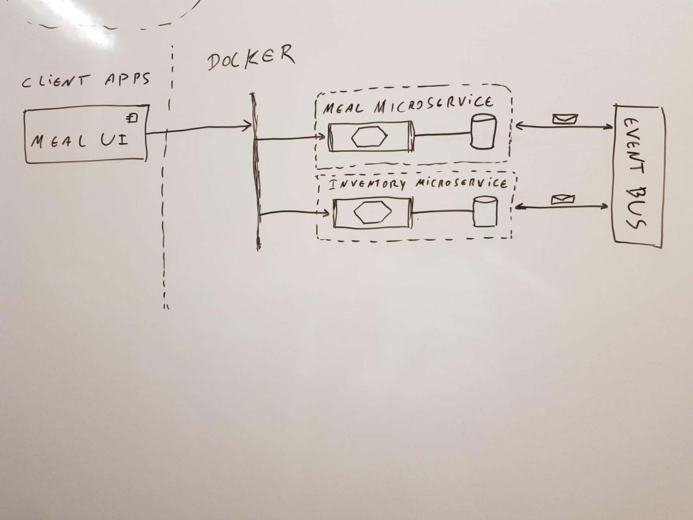
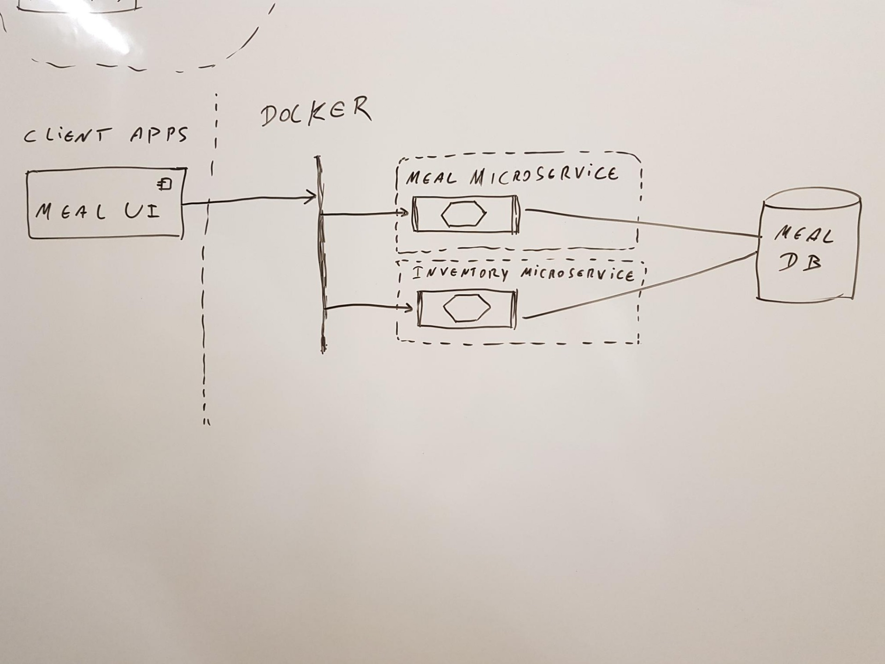
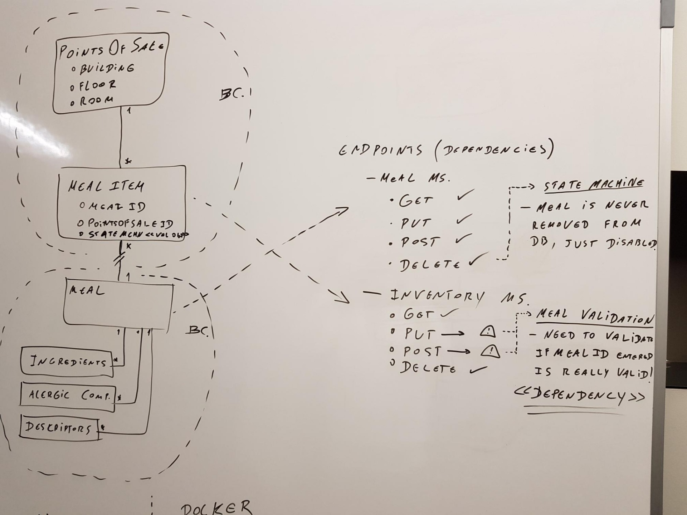
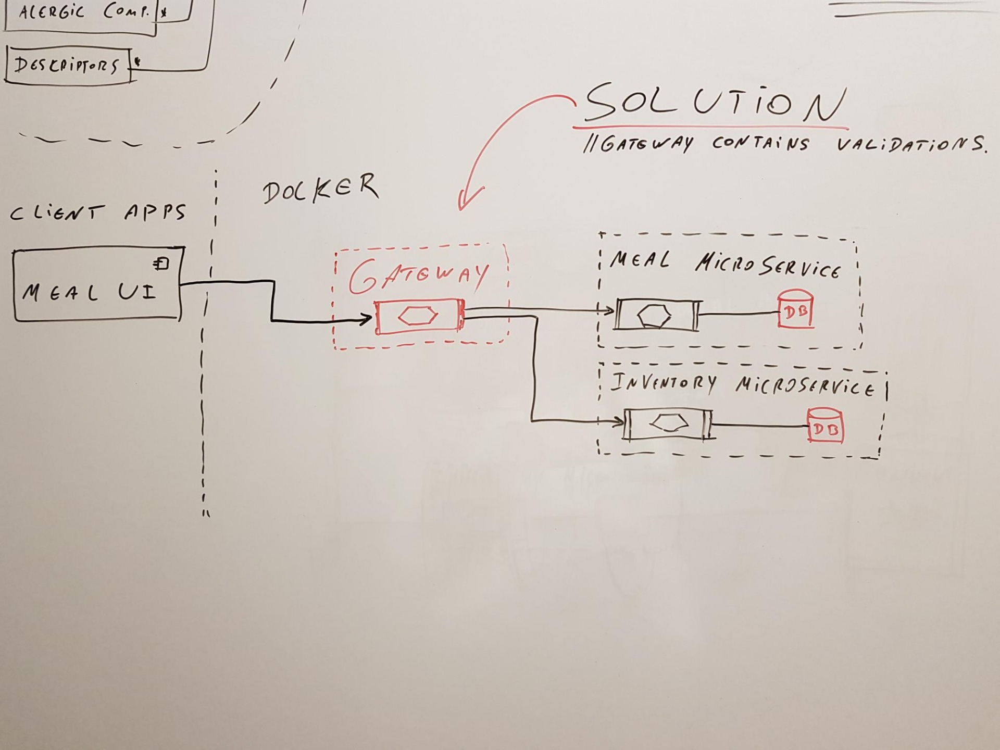

# Gorgeous Food App ADD P2 Iteration 1#

## What we have now

## Defining Bounded Contexts

## Perfect Solution according to examples

## Solution found based in team knowledge and separation of entities

## Dependency study after planed solution and troubleshooting

## Second solution found after troubleshooting
