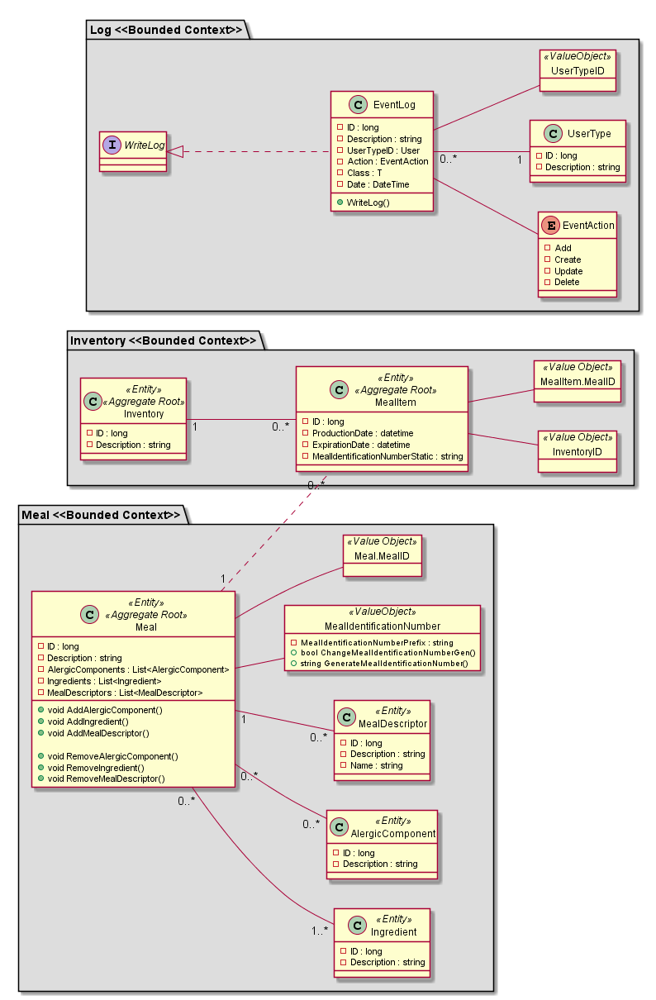
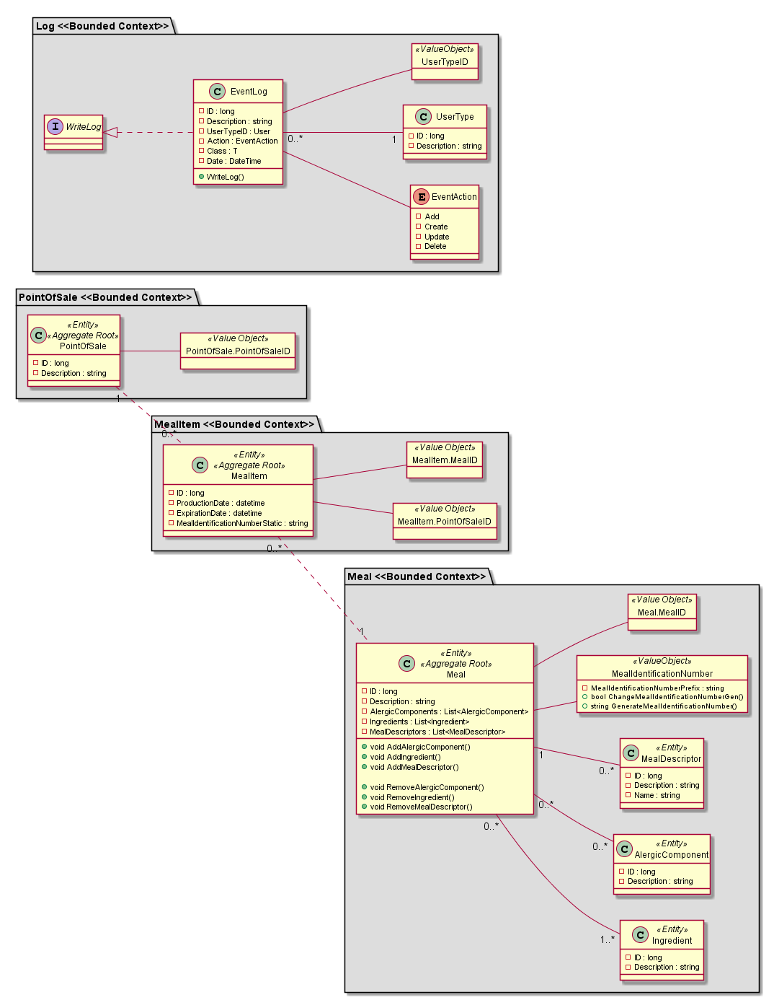
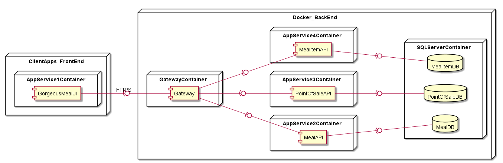

# Gorgeous Food App ADD P2 Iteration 1#

## What we have now

As we can see, actually we have a simple monolithic Web Application with a single FrontEnd, a single BackEnd API and a single Database containing all the information about Meal and MealItems.

---

## Defining Bounded Contexts

This second part's main objective is migration to microservices. For that we need to define Bounded Contexts.
Based on Arquitectural Driver 'P2D2' we decided to divide Meal and it's subcomponents (Ingredients, Allergens and Nutrition data) from MealItem and Inventory(PointOfSale) thus creating a Bounded Context on it's own with specific rules.

---

## Perfect Solution according to examples

According to ".NET Microservices: Architecture for Containerized .NET Applications", we designed a 'perfect' solution with the best practices according to the book. Infortunatly, this topic is still new for the development team so, Event sourcing and development is still out of technical scope.

---

## Solution found based in team knowledge and separation of entities

---

## Dependency study after planed solution and troubleshooting

---

## Second solution found after troubleshooting

---

## Reavaluate Bounded Contexts after Service Cutter study

---

## Third Solution after Service Cutter study
