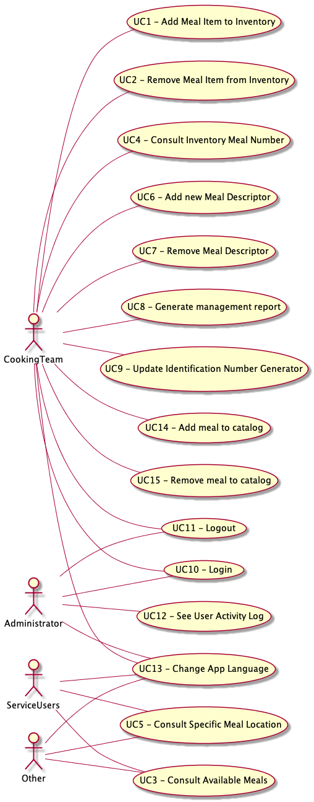

# Gorgeous Food Company #
This file contains all the drivers and a resume of the decomposition patterns use for the project.

## Drivers
P1D1. > The application to be developed must be accessible from a variety of platforms using a web browser.

P1D2. > This application must be developed by the school’s technical staff and should be available in two months. Within five weeks, adding and removing new items to inventory should be demonstrated to many stakeholders. Not only because of these factors, inventory update functionalities are especially relevant to the organization, and very difficult for the team.

P1D3. > Multilanguage is desirable as the school accepts foreign students on a regular base, and the service will probably attract tourists, but not for what is used only by school staff. Multilanguage support is considered by the client to be of medium importance, and it’s difficult for the developing team is insignificant.

P1D4. > The team is free to choose the technological stack to use in the project, but, for cost reasons, only open-source technologies can be adopted.

P1D5. > There are a number of meal descriptors (per 100 g) that are initially considered as calorie, for instance, but others may be considered in the future. Thus, it is intended that the introduction of new ones affects very little, or nothing, other components of the application. The addition of a new descriptor should be completed and tested in less than 0.5 person-day of effort. This scenario is considered of great importance for the school, and the degree of its technical risk is high.

P1D6. > Changes in the meal identification number generation should not affect more than one component. This is considered very important for the organization as there are here some uncertainties and, in the future, some special equipment might be used for the label printing and reading, with the introduction of some requirements and changes. A change in the generation of this number identification is to be implemented with no side effects in 1 person-day of effort. This scenario is considered of high importance for the success of the application and the degree of its technical risk is medium.

P1D7. > The application should be able to provide management reports, such as the number of meals, grouped by type, sold at certain times of the day (14:30 to 17, for instance) or days of the week. Due to the composition of advisory and management bodies, it should be possible to generate reports in more than one language. This scenario is considered of high importance for the success of the application and the degree of its technical risk is medium.

P1D8. > Some architectural specific concerns: authentication, authorization, and activity log. Administrator should be able to query user logs and see their activities, all of them, or performed between dates or only some type of activities.

P1D9. > The school has a database server with a backup policy implemented and it is to be used by the application to be developed. In addition, there is a user directory server used by other applications in the school and the new application is also to use it.

P2D1. > The application to be developed must be accessible from a variety of platforms using a web browser.

P2D2. > Ingredients, allergens and nutrition data for meals are to be accessible without the need for authentication, and the application should provide fast responses in comparison to inventory updates.

P2D3. > This application must be developed by the school’s technical staff and should be available in nine months.

P2D4. > Within four weeks queries related to the number of available items for specific meals, but also adding and removing new items to inventory (microservices) should be demonstrated to many stakeholders. These functionalities are especially relevant to the organization and extremely difficult for the team that never worked with microservices. Aware of these difficulties, this very initial prototype does not need to use service discovery registries, but local method calls need to be replaced by synchronous remote calls, or better options. Direct dependencies in the database are to be eliminated depending on the adopted data management strategies. The use of messaging needs more time and will be covered in another prototype.

P2D5. > For the nutritional descriptors, it is necessary to consider their designation, measure unit, but also the maximum reasonable amount to be used for validation purposes.

P2D6. > Given the team’s lack of awareness of microservices, a presentation/discussion session on the decomposition approach and proposed microservices is also scheduled in 4weeks. An experienced technical team will be present.

P2D7. > The team is free to choose the technological stack to use in the project, but, for cost reasons, only open-source technologies can be used.

---

## UseCases Board
Actor | Use Case | Description
--- | --- | ---
CT | UC1 - Add Meal Item to Inventory | The cooking team/staff can create a item with a specific meal. The ingredients are associated with the meal.
CT | UC2 - Remove Meal Item from Inventory | The cooking team/staff can remove a item of a specific meal.
SU | UC3 - Consult the available meals | Students and Other interested people can consult the available meals.
CT | UC4 - Consult Inventory Meal Number | Cooking team/staff can consult the inventory of the existing meals.
SU | UC5 - Consult Specific Meal Location. | Students and other starving people can consult the location of their preferred meals.
CT | UC6 - Add new Meal Descriptor | The staff can create  meal descriptions
CT | UC7 - Remove Meal Descriptor | The staff can remove  meal descriptions
CT | UC8 - Generate management report | The staff can request to the system management reports about how many meals and their information.
CT |UC9 - Update identification number generator. | The staff can update the identification generator, so that the number generator meets the specified characteristics.  
CT, CA | UC10 - Login | Want to login.
CT, CA | UC11 - Logout | Want to logout.
CA | UC12 – See User Activity Log. | The administrator can query the system to consult logs about the activity on the application.
CA, CT, SU | UC13 - Change App Language. | The users want to use the application on several languages.
CT | UC14 - Add/Update new Meal | The cooking team/staff can create a meal and create/associate the ingredients.
CT | UC15 - Remove Meal | The cooking team/staff can remove a meal.

*`Actors`* – SU-> ServiceUsers, CT-> Cooking Team, CA-> Canteen Admin.

---

## Use Case Diagram

---

## Business Capability Decomposition
In this topic the objective is to use the business capability pattern to identify what the business does. This decomposition helps to identify features/processes that may be converted to microservices.
The business capability is a description of what a business does, independently of how or why.
After the analyses of the Company objectives and structure it were identified four capabilities. They are explicit in the following tables.

---

Reference | Descriptor
--- | ---
ID | Capability Identification Number
Type | Business Activity
Definition | Description of the business activity
Inputs | Inputs on the business activity.
Outputs | Outputs of the business activity
Artifacts | Identification of the Artifacts involved in the capability.

---

--- | ---
ID | C1
Type | Inventory Management
Definition | The company manages the inventory of their meals. It can add and update the meals in the inventory. Also includes the POS (point of sale) id.
Inputs | 1.	A meal is produced, and a member of the staff adds that meal to the inventory. 2.	A sale occurs and the specific item is updated. 3.	The item reaches its expiration date, so it is updated/removed.
Outputs |
Artifacts | UC1-4, P2D4

---

--- | ---
ID | C2
Type | Meal Management
Definition | The company provides information about the ingredients, allergens and nutrition data for the available meals.
Inputs | 1.	A user requests information about a meal.
Outputs | 1.	A list of information about the meal is provided, including the ingredients, allergens and nutrition.
Artifacts | P2D2, P2D5

---

--- | ---
ID | C3
Type | Descriptor Creation
Definition | A meal descriptor formula is used to generate the meal descriptor. The company has the capability to change/update that formula
Inputs | 1.	A admin/staff updates the formula for the meal descriptor.
Outputs | 1.	The new formula is adopted in the creation of meals.
Artifacts | UC6-7, UC9

---

--- | ---
ID | C4
Type | Report Generation
Definition | The company creates reports about the several business activities.
Inputs | 1.	A report is requested with specific parameters (date, items, meals, sales, etc)
Outputs | 1.	A report is generated and made available.
Artifacts | UC8, UC12

---

--- | ---
ID | C5
Type | POS Location
Definition | The company as several POS that have different locations and have different stats.
Inputs | 1.	A admin/staff updates the POS location. 2. A admin/staff adds a new POS. 3. A ServiceUser consults the near POS.
Outputs | 1. A POS location is made available.
Artifacts | P2D4

---

## Decomposition with Service Cutter Tool
In this topic the objective is to continue exploring the decomposition of the system, this time with the aid of a tool.
The explored tool is the Service Cutter (https://servicecutter.github.io/).

## Service Cutter Tool ##
This tool is a prototype that offer a 16 coupling criteria and use this criteria to propose a decomposition of a system into microservices. The tool use well-stablished artifacts of the system, like domain models and use cases.

After the installation of the tool two files are needed to express the current system.
The food_model, has the system domain, data, operations and artifacts, expressed in a json format.
The food_2_user_representation file, expresses the use case and relations of the system entities and responsible roles.

This documents are stored in [Food_model](../resources/food_model.json) and [Food_2_user_representation](../resources/food_2_user_representation.json).

## Results ##

The tool as two algorithms for decomposition. The Leung and Girvan-Newman algorithm.

### Girvan-Newman Result ###

.

The Girvan-Newman algorithm suggests five microservices for the system.

Service A -> for the user management;
Service B -> for the log management;
Service C -> for the meal management;
Service D -> for the meal descriptor management;
Service E -> for inventory management;

### Leung Result ###

.

The Leung algorithm suggests four microservices for the system.

Service A -> for inventory management;
Service B -> for the log management;
Service C -> for the user management;
Service D -> for the meal and descriptor management;

## Business Subdomain Decomposition
In this topic the objective is to decompose the system using the subdomain pattern.
The use of the subdomain decomposition pattern will be useful to compare their results to the previous decompositions, so a better general decomposition of the system can be achieved.

.

Analyzing the current system five bounded contexts were identified. The previous image shows the entities used.

1º Subdomain -> Inventory Bounded Context, that manages all the interactions involving the inventory.
---
2º Subdomain -> POS Bounded Context, witch is responsible for the definition of the point of sale.
---
3º Subdomain -> MealItem Bounded Context, that represents the MealItem operations and attributes.
---
4º Subdomain -> Meal Bounded Context, represents all the operations and attributes of the meal.
---
5º Subdomain -> Logging Bounded Context, represents the structure operations and attributes of the logging.

## Kanban Board
Task | Not Addressed | Partially addressed | Addressed
--- | --- | --- | ---
Decomposition By Business Capability | | X
Decomposition By Subdomain | | | X
Decomposition Using Service Cutter | | | X

---
