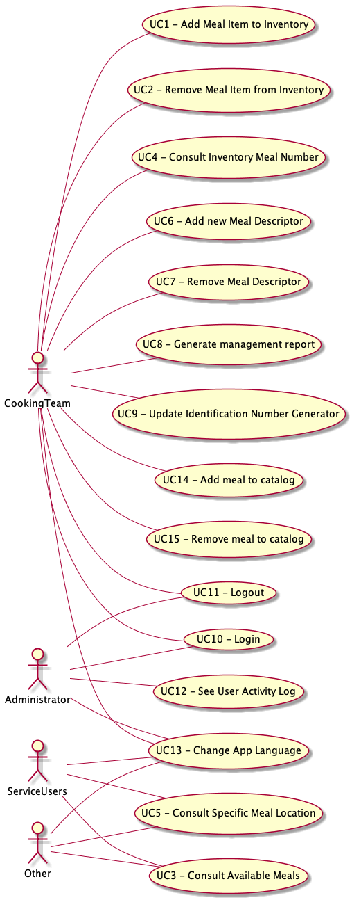

# -insert nice title here- #

## Drivers

---

## UseCase Board
Actor | Use Case | Description 
--- | --- | ---
CT | UC1 - Add Meal Item to Inventory | The cooking team/staff can create a meal. 
CT | UC2 - Remove Meal Item from Inventory | The cooking team/staff can remove a meal. 
S, O | UC3 - Consult the available meals | Students and Other interested people can consult the available meals. 
CT | UC4 - Consult Inventory Meal Number | Cooking team/staff can consult the inventory of the existing meals. 
S, O | UC5 - Consult Specific Meal Location. | Students and other starving people can consult the location of their preferred meals. 
CT | UC6 - Add new Meal Descriptor | The staff can create  meal descriptions
CT | UC7 - Remove Meal Descriptor | The staff can remove  meal descriptions
CT | UC8 - Generate management report | The staff can request to the system management reports about how many meals and their information.
CT |UC9 - Update identification number generator. | The staff can update the identification generator, so that the number generator meats the specified characteristics.  
CT, A | UC10 - Login | Want to login. 
CT, A | UC11 - Logout | Want to logout. 
A | UC12 – See User Activity Log. | The administrator can query the system to consult logs about the activity on the application. 
A, CT, S, O | UC13 - Change App Language. | The users want to use the application on several languages. 

*`Actors`* – Students (S), Cooking Team, Others, Canteen Admin. 

---
## Quality Atributes

ID | Quality Atribute | Scenario | Associated UC
--- | --- | --- | ---
QA-1 | Multilanguage | The addiction of a new language should not affect the system (negatively). | UC13
QA-2 | Change the Identification Generator | When the generator is edited, the existing components should not be affected. | UC9
QA-3 | Run in multiple browsers | Run on several browsers, including mobile. | -
QA-4 | Generation of reports in several languages. | The admin requests a report with a different language. | UC13
QA-5 | Open-source technologies | The system is  | -

---

## Use Case Diagram

---

## Deployment Diagram

---

# README

This README would normally document whatever steps are necessary to get your application up and running.

### What is this repository for? ###

* Quick summary
* Version
* [Learn Markdown](https://bitbucket.org/tutorials/markdowndemo)

### How do I get set up? ###

* Summary of set up
* Configuration
* Dependencies
* Database configuration
* How to run tests
* Deployment instructions

### Contribution guidelines ###

* Writing tests
* Code review
* Other guidelines

### Who do I talk to? ###

* Repo owner or admin
* Other community or team contact