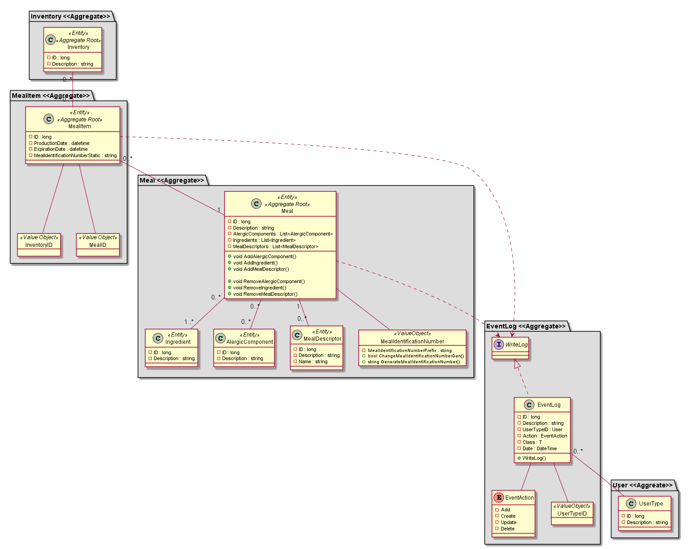
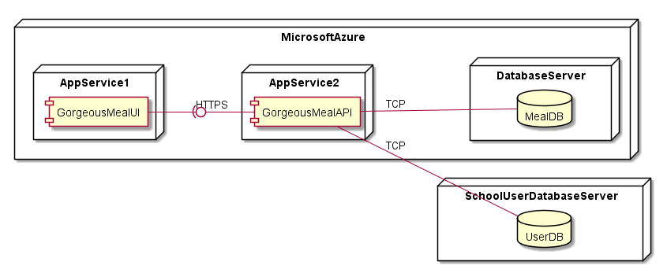

# Gorgeous Food App #
Gorgeous Food Application development is supported by the Attribute-Driven Design (ADD) methodology.

## Iteration 1

*Goal:*

## Iteration 2

*Goal:*

## Iteration 3

*Goal:*

## Drivers
1. > The application to be developed must be accessible from a variety of platforms using a web browser.

2. > This application must be developed by the school’s technical staff and should be available in two months. Within five weeks, adding and removing new items to inventory should be demonstrated to many stakeholders. Not only because of these factors, inventory update functionalities are especially relevant to the organization, and very difficult for the team.

3. > Multilanguage is desirable as the school accepts foreign students on a regular base, and the service will probably attract tourists, but not for what is used only by school staff. Multilanguage support is considered by the client to be of medium importance, and it’s difficult for the developing team is insignificant.

4. > The team is free to choose the technological stack to use in the project, but, for cost reasons, only open-source technologies can be adopted.

5. > There are a number of meal descriptors (per 100 g) that are initially considered as calorie, for instance, but others may be considered in the future. Thus, it is intended that the introduction of new ones affects very little, or nothing, other components of the application. The addition of a new descriptor should be completed and tested in less than 0.5 person-day of effort. This scenario is considered of great importance for the school, and the degree of its technical risk is high.

6. > Changes in the meal identification number generation should not affect more than one component. This is considered very important for the organization as there are here some uncertainties and, in the future, some special equipment might be used for the label printing and reading, with the introduction of some requirements and changes. A change in the generation of this number identification is to be implemented with no side effects in 1 person-day of effort. This scenario is considered of high importance for the success of the application and the degree of its technical risk is medium.

7. > The application should be able to provide management reports, such as the number of meals, grouped by type, sold at certain times of the day (14:30 to 17, for instance) or days of the week. Due to the composition of advisory and management bodies, it should be possible to generate reports in more than one language. This scenario is considered of high importance for the success of the application and the degree of its technical risk is medium.

8. > Some architectural specific concerns: authentication, authorization, and activity log. Administrator should be able to query user logs and see their activities, all of them, or performed between dates or only some type of activities.

9. > The school has a database server with a backup policy implemented and it is to be used by the application to be developed. In addition, there is a user directory server used by other applications in the school and the new application is also to use it.

---

## UseCase Board
Actor | Use Case | Description 
--- | --- | ---
CT | UC1 - Add Meal Item to Inventory | The cooking team/staff can create a item with a specific meal. The ingredients are associated with the meal.
CT | UC2 - Remove Meal Item from Inventory | The cooking team/staff can remove a item of a specific meal. 
SU | UC3 - Consult the available meals | Students and Other interested people can consult the available meals. 
CT | UC4 - Consult Inventory Meal Number | Cooking team/staff can consult the inventory of the existing meals. 
SU | UC5 - Consult Specific Meal Location. | Students and other starving people can consult the location of their preferred meals. 
CT | UC6 - Add new Meal Descriptor | The staff can create  meal descriptions
CT | UC7 - Remove Meal Descriptor | The staff can remove  meal descriptions
CT | UC8 - Generate management report | The staff can request to the system management reports about how many meals and their information.
CT |UC9 - Update identification number generator. | The staff can update the identification generator, so that the number generator meats the specified characteristics.  
CT, CA | UC10 - Login | Want to login. 
CT, CA | UC11 - Logout | Want to logout. 
CA | UC12 – See User Activity Log. | The administrator can query the system to consult logs about the activity on the application. 
CA, CT, SU | UC13 - Change App Language. | The users want to use the application on several languages. 
CT | UC14 - Add/Update new Meal | The cooking team/staff can create a meal and create/associate the ingredients.
CT | UC15 - Remove Meal | The cooking team/staff can remove a meal.

*`Actors`* – SU-> ServiceUsers, CT-> Cooking Team, CA-> Canteen Admin. 

---

## Quality Atributes
ID | Quality Atribute | Scenario | Associated UC | Priority | Dev Difficulty
--- | --- | --- | --- | --- | ---
QA-1 | Usability | The system displays a variety of Languages.  | All | Medium | Insignificant
QA-2 | Modifiability | When the generator is edited, the existing components should not be affected. | UC9 | High | Medium
QA-3 | Modifiability | The addiction of a new language should not affect the system (negatively). | All | Low | Insignificant
QA-4 | Compatibility | Run on several browsers, including mobile. | - | High | Medium
QA-5 | Usability | The admin requests a report with a different language. | UC13 | Medium

---

## Constrains
ID | Description
--- | ---
CT-1 | The system is developed and maintained using Open-Source Technologies without requiring paying licenses.
CT-2 | The application should be available in two months.
CT-3 | Within five weeks, adding and removing new items to inventory should be demonstrated.
CT-4 | The addition of a new descriptor should be completed and tested in less than 0.5 persons day of effort.
CT-5 | A change in the number identification generator should not take more than 1 person-day of effort.
CT-6 | The application must be accessible from several browser (ex: Chrome, Firefox) in different platforms (ex: Windows, Linux, OSX).

---

## Achitectural Concerns
ID | Concerns
--- | ---
AC-1 | The application should use the school database server.
AC-2 | The application should use the school user directory server.
AC-3 |  Take advantage of the team's technical knowledge of C# programming language.

---

## Use Case Diagram

---

## Domain Model

---

## System Deployment View

---

## Logical View of Server Components
